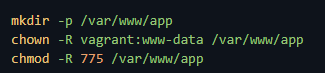
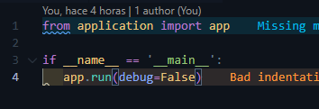
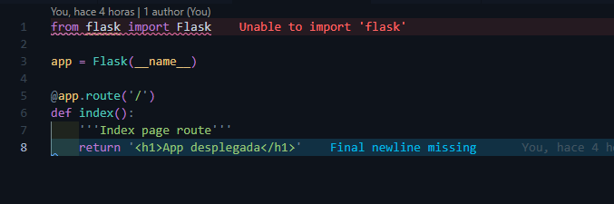
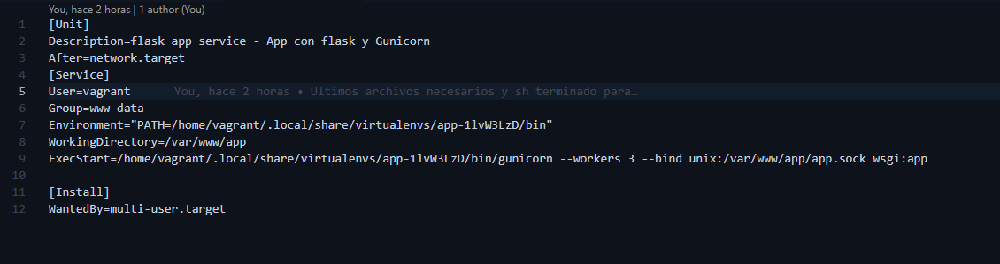
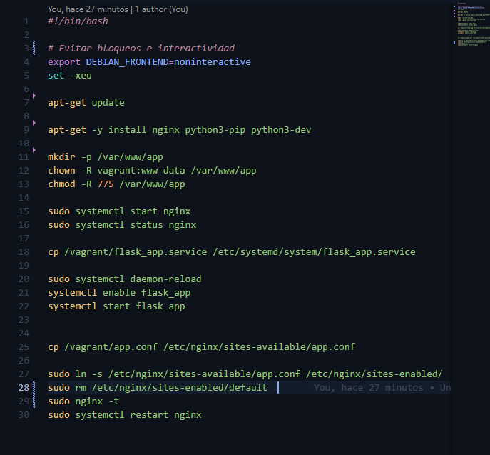
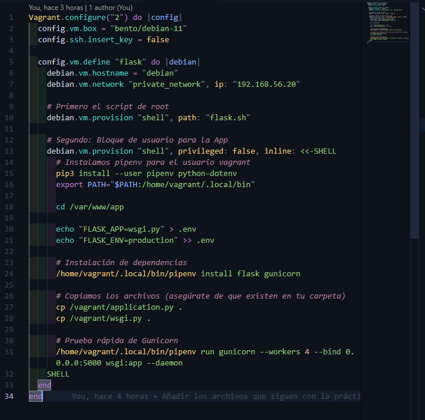

# Python-flask-gunicorn
Para empezar esta tarea nos dice que tenemos que tener instalados los siguientes paquetes:
`Nginx`, `Guincorn` y `Pipenv`.

Una vez que nos hemos leido la Introducción ya podemos pasar a la parte de despliegue, y así empezar con los comandos necesarios para desplegar nuestra aplicación.

## Despliegue
Como yo lo he estado haciendo en Vagrant, y como dice la práctica no voy a realizar todo como administrador, sino que algunas cosas las voy a realizar como root y otras como usuario.

Por tanto unos comandos estarán en el flask.sh y otros dentro del Vagrantfile.

Tenemos que tener una cosa en cuenta, todos los comandnos que tengan sudo, serán los que se ejecutarán como root, y los que no lo harán serán los que se ejecutarán como usuario. Cuando termine de nombrar todo lo que tenemos que hacer añadiré unas capturas de como quedaría cada archivos.

### Comandos
Lo primero será instalar el gestor de paquetes de Python y será con el comando: 
`sudo apt-get update && sudo apt-get install -y python3-pip`.

Para gestionar los entornos virtuales vamos a instalar Pipenv, con `pip3 install pipenv`.

Lo siguiente será instalar el paquete para cargar las variables de entorno que esto sera instalando dotenv, con `pip3 install python-dotenv`.

Lo siguiente será crear un directorio para nuestra aplicacion y evidentemente tenemos que cambiar el usuario y el grupo, además de los permisos pertinentes.

Dentro de nuestra maquiína deberíamos tener un directorio llamado `app`, donde crearemos un archivo oculto llamado `.env` en el cual tenemos que meter dos variables más, en las cuales una de esta es pasarle un archivo de configuración que tenemos que crear desde fuera y pasarselo al interior como hemos visto en otros trabajos con un `cp`. 
El interior del archivo llamado `wsgi.py` es: 

Ahora tenemos que meternos en la carpeta de app, para esto la ruta es `/var/www/app` y una vez que estamos dentro de esta carpeta tenemos que seguir con la instalción, en concreto de gunicorn, con `pipenv install flask gunicorn`. 

El siguiente paso es tocar el archivo de `application.py` y modificarlo, pero para que sea automático vamos a hacerlo como antes, basicamente creamos el archivo fuera, metemos la configuración y lo copiamos dentro de la máquina. 

Lo siguiente serñá probar si la aplicación de verdad funciona de manera local, y para esto lo haremos con el comando `pipenv run gunicorn --workers 4 --bind 0.0.0.0:5000 wsgi:app --daemon`. 
Ahora para conectarnos lo vamos a hacer con no-ip, con el puerto 5000, aquí solo veremos una pantalla blanca con las palabras "App desplegada".

EL siguiente paso que vamos a hacer es configurar nginx, para lanzar la aplicación, metemos sus comandos necesarios `sudo systemctl start nginx` y `sudo systemctl status nginx`.

Vamos a crear un archivo fuera de la máquina, llamado `flask_app.service` y le voy a poner la configuración asignada en la tarea:

Seguiremos con el comando `sudo systemctl daemon-reload` y `systemctl enable flask_app` para que se inicie automáticamente.

Finalmente crearemos otro archivo fuera de la máquina llamado `app.conf` y lo tenemos que pasarlo a la carpeta de `/etc/nginx/sites-available/` con la configuración para ver la página en nuestra IP, desde el puerto 80.
Ahora tenemos que crear un link simbólico con los comandos que nos pone en la tarea: `sudo ln -s /etc/nginx/sites-available/app.conf /etc/nginx/sites-enabled/` y `ls -l /etc/nginx/sites-enabled/ | grep app.conf`.
Solo tendremos que reinciar el servicio de nginx y habilitarlo de nuevo y estará listo.

Por tanto así quedaría el archivo Vagrantfile:

Y el archivo de flask.sh:

## Tarea de ampliación
